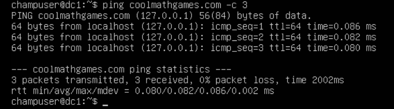
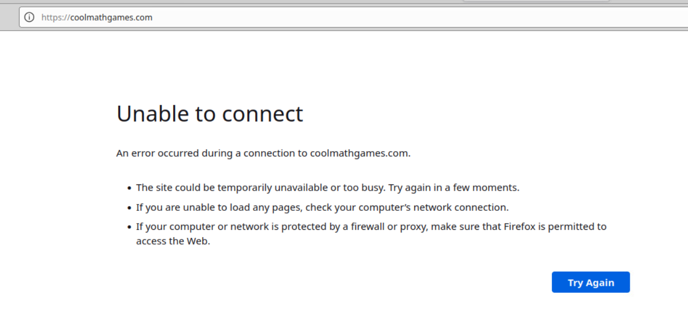

:toc: left
= Test Lab Guide: Ubuntu 20.04 - Archery, GRR, & DNS RPZ

== Introduction
This document is designed to be used in tandem with the Unix Test Lab Guide (TLG) for Ubuntu 20.04. It contains instructions on how to install, configure, and test Archery, GRR Rapid Response, and DNS RPZ. This guide will provide the user a step-by-step guide, upon completion of which will allow them to build their skills for use in future labs or activities. All configuration steps for Archery and GRR should be done on the Applications Server system unless otherwise noted. All configuration steps for DNS RPZ should be done on the Domain Controller system unless otherwise noted.

== Installation of Archery

. Archery itself can be quickly set up and installed using a Docker image, but it has multiple requirement softwares that will need to be installed as well. To get the Docker image up and running, you will first need to update your apt library and install Docker:
+
```
sudo apt-get update
sudo apt-get install docker.io
```
. After docker has finished installing pull the Archery image.
+
`sudo docker pull archerysec/archerysec`

. Once the pull has been completed, initialize the image with docker run to get the Archery WebUI up and running.
+
```
docker run -e NAME=user -e EMAIL=user@user.com -e PASSWORD=admin@123A  -it -p  8000:8000 archerysec/archerysec:latest
```
. Next you will need to install and setup at least one of the required scanner softwares such as OpenVAS, Owasp ZAP, or Burp.
 
== Testing of Archery

. On your client1 device, open a webbrowser and browse to the ip of your archery host server on port 8000.

. Log in using the email and password you provided in the docker run command during setup.

== Installation of GRR Rapid Response

The easiest and quickest way to install and set up GRR for testing purposes is with a Docker image.

. Update your apt library and install Docker:
+
```
sudo apt-get update
sudo apt-get install docker.io
```
. After docker has finished installing pull the GRR image.
+
`sudo docker pull grrdocker/grr:latest`

. Once the pull has been completed, initialize the image with docker run to begin testing with GRR.
+
```
sudo docker run --name grr-server -e EXTERNAL_HOSTNAME="GRR Host Server IP" -e ADMIN_PASSWORD=demo -p 0.0.0.0:8000:8000 -p 0.0.0.0:8080:8080 grrdocker/grr:latest
```

. Once the initialization has finished you will be able to access the GRR Server WebUI from your Ubuntu Client by browsing to the ip of your GRR host server on port 8000. When you are prompted for login information use the username "admin" and the password "demo".
+

In order to start testing with the newly setup GRR Server, you will have to setup a GRR Client to communicate with the server.

. On your Ubuntu Client, after browsing to your GRR Server WebUI, go to the Binaries page under Configuration.
+
. Download the .deb file onto the Ubuntu Client.
+
. Open a terminal and install the client .deb file you just downloaded.
+
```
cd Downloads
sudo dpkg -i grr_3.4_6.0_amd64.deb
```
. After installation completes, ensure that the GRR Client is now communicating with the GRR Server by going back to the WebUI and hitting the search magnifying glass while leaving the Search Box blank. This will list all connected GRR Clients and you should be able to see the single GRR Client you just setup.

== Testing of GRR Rapid Response
*Client Features*

After searching for available clients select one by clicking on it to begin using client features.

. Host Information
+

> The simplest Client Feature of GRR is being able to view the host information for your client devices. This will list things like the Client's Operating System and when it was installed, Architecture, Memory Size, and interfaces.

. Virtual Filesystem Browsing
+

> GRR allows you to browse a virtual filesystem of all your clients so you can look through every directory and file on the device.

. Flows

> You can run Flows on specific clients to find all sorts of information about it from browser histories, to file types, to active network connections and many more. Flows need to be created on the start new flows page and then they can be managed while they are running or completed on the Manage Launched Flows page where you can view the flow results.

*Server Features*

. Hunts
+

> Hunts are essentially Flows that you can run on multiple clients at the same time. All of the information to search for in Hunts are the same as Flows, but you can set rules to determine which clients will be a part of the hunt based on variables like operating system or labels.

. Cron Jobs
+

> With the Crob Jobs feature you can schedule Hunts to be done in the future and setup periodic Hunts.

. Statistics

> The Statistics page lets you see everything that has been done in GRR Server like Cron Jobs and Hunts that have been approved and run. You can also view how many clients have been active and connected to GRR Server at a given time and what Flows have been run by the System or individual Users.


== Configuration of DNS RPZ
After the basic DNS setting have been configured on DC1 following the UTLG Guide, you can begin setting up DNS RPZ.

. First, edit the named.conf.options file.
+
`sudo nano /etc/bind/named.conf.options`

.. Add the following lines in the options {...} clause to enable response policy zone. (The first line is a comment.)
+
```
//enable response policy zone. 
response-policy { 
    zone "rpz.local"; 
};
```

. Save and close the file. Then open the named.conf.local file.
+
`sudo nano /etc/bind/named.conf.local`

.. Add an RPZ zone in this file.
+
```
zone "rpz.local" {
    type master;
    file "/etc/bind/db.rpz.local";
    allow-query { localhost; };
    allow-transfer { localhost; };
};
```

. Save and close the file. Then we need to create the zone file. Instead of creating a zone file from scratch, we can use a zone template file. Copy the content of db.empty to a new file.
+
`sudo cp /etc/bind/db.empty /etc/bind/db.rpz.local`

. Then edit the db.rpz file.
+

`sudo nano /etc/bind/db.rpz.local`

.. There is no need to change the existing content. We just add our custom DNS records. For instance, if you have a Nextcloud server on the local network with an IP address 192.168.0.103, then you add the following DNS record, so Nextcloud clients don’t have to go out to the Internet in order to connect to the Nextcloud server.
+
`nextcloud.your-domain.com      A   192.168.0.103`

. Save and close the file. It’s recommended to use a separate log file for RPZ to better analyze the log. To configure, edit the BIND main configuration file.
+

.. Add the following lines to the file.
+
```
logging {
    channel rpzlog {
  	file "/var/log/named/rpz.log" versions unlimited size 100m;
    	print-time yes;
    	print-category yes;
    	print-severity yes;
    	severity info;
    };
    category rpz { rpzlog; };
};
```

. Save and close the file. Then create the /var/log/named/ directory and make bind as the owner.
+

```
sudo mkdir /var/log/named/
sudo chown bind:bind /var/log/named/ -R
```

. Restart bind9

`sudo systemctl restart bind9`

== Testing of DNS RPZ
. Add any domains you want blocked to the /etc/bind/db.rpz.local file with the following format.
+

```
example.com A 127.0.0.1
*.example.com A 127.0.0.1
```

. Every time you add a new domain to this file after saving and exiting you will need to restart bind9.
+ 

`sudo systemctl restart bind9`

. To test if the domains have been successfully blocked or not you can ping the domain on dc1 and you should receive responses from the localhost 127.0.0.1 instead of the actual blocked domain.
+

`ping example.com -c 3`




You can also test this by opening a browser on client1 and attempting to browse to the blocked domain. You should get an Unable to connect error.


